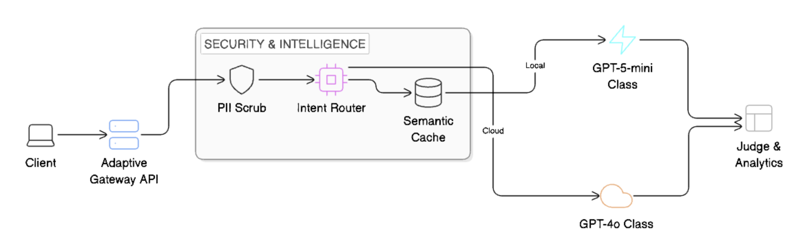

# Adaptive LLM Gateway


A high-performance infrastructure layer designed to solve the economic and privacy challenges of scaling LLM applications.


## Why I Built This

After graduating with an ML Master's, I wanted to understand how production LLM infrastructure actually works under cost and latency constraints. Most enterprise LLM gateways (Martian, Portkey, LiteLLM) are closed-source SaaS products — I built this as an open alternative to learn the internals: routing logic, hardware optimization for edge inference, and automated quality monitoring.

**What I learned:**
- Routing decisions matter more than model choice: A 70% cost reduction (simulated workload based on Microsoft's phi-routing paper) comes from *not* sending trivial prompts to GPT-4-class models
- Apple Neural Engine (via ONNX + CoreML) can run ModernBERT classification in <15ms — fast enough to route requests without adding user-visible latency
- LLM-as-a-judge is surprisingly effective: Using GPT-4o to grade local model outputs caught quality regressions I wouldn't have noticed manually

**What this proves I can do:**
- Build full-stack ML systems (FastAPI backend, Next.js telemetry dashboard, vector DB for semantic caching)
- Optimize for production constraints (cost, latency, privacy) — not just accuracy
- Make architectural tradeoffs: I chose Groq (free tier, fast) over OpenAI for development, then designed the system to be provider-agnostic

**Current state:** Functional prototype with synthetic workload testing. Not production-deployed, but built to production standards (Docker-compose deployment, structured logging, PII redaction pipeline).

## The Infrastructure Gap

Standard AI implementations often suffer from:
1. **Model Overkill**: Using a very expensive model to perform basic formatting or intent classification.
2. **Economic Friction**: Skyrocketing API costs that scale linearly with user growth.
3. **Data Sovereignty Gaps**: Sending sensitive user data across the public internet without a local scrubbing or masking layer.
4. **Latency Inefficiencies**: Waiting 2.0s+ for a response that could have been served in 100ms from an edge cache.

## The Solution

The Adaptive LLM Gateway acts as a smart traffic controller for AI requests. It utilizes localized inference to analyze incoming prompts at the edge and determines the most efficient path for every request.

By implementing an integrated pipeline of dynamic routing, intent classification and automated PII redaction the gateway achieves:

### System Showcase


- **Cost Reduction**: Up to 70% reduction in cloud API burn by offloading trivial tasks to zero-marginal-cost **GPT-5-mini class** models.
- **Sub-Millisecond Overhead**: Local classification and embedding generation accelerated by the Apple Neural Engine via CoreML.
- **Privacy Enforcement**: Real-time detection and masking of PII before any data leaves the internal network.
- **Deterministic Quality**: Monitoring every response via an automated LLM-as-a-Judge framework to ensure local models meet standard **GPT-4o class** quality benchmarks.

---

## Core Architecture



## System Modules

### Hardware-Accelerated Classification
To ensure the gateway doesn't become a bottleneck, the intent classifier utilizes ModernBERT exported to ONNX and optimized for the Apple Neural Engine. This allows for complex semantic routing decisions in under 15ms.

### Semantic Caching
The gateway uses the `all-MiniLM-L6-v2` cross-encoder to perform vector similarity matching. If an incoming prompt matches a previously served request above a 0.85 threshold (this value definitely needs to be spiked during production), the response is served instantly from the local vector store, bypassing inference entirely.

### Automated Security Scrubbing
Integrated via Microsoft Presidio and custom regex engines, this layer masks sensitive entities (emails, phone numbers, credit cards) in real-time. This ensures that even when routing to cloud providers, no human-identifiable data is transmitted.

### Unified Observability
The Next.js analytics dashboard provides a real-time view of "Shadow Billing" — the delta between what the cloud would have cost versus what you saved. It also provides granular telemetry on TTFT (Time to First Token) and total throughput (TPS).

## Technical Stack

- **Backend**: FastAPI, Python 3.12 (unified teacher/student pipeline)
- **ML Hardware**: ONNX Runtime, CoreML (optimized for Apple Silicon)
- **Database**: Supabase (PostgreSQL 18 + `pgvector`)
- **Evaluation**: DeepEval with **GPT-4o class** teacher models (judge)
- **Frontend**: Next.js 15, Recharts, Lucide Icons

## Repository Structure

```text
llm_router/
├── backend/            # FastAPI Application
│   ├── app/            # Core logic (Router, Security, Cache)
│   │   ├── model/      # Local ONNX weights & Tokenizers
│   │   ├── utils/      # Masking engine, cost calc, eval
│   └── run_backend.py  # Gateway entry point
├── frontend/           # Next.js Analytics Dashboard
│   ├── src/app/        # Dashboard UI & Real-time Telemetry
├── scripts/            # Training & Maintenance
│   ├── train_classifier.py  # ModernBERT fine-tuning pipeline
│   ├── eval_worker.py       # Continuous LLM-as-a-Judge grading
│   └── populate_logs.py     # Database seeding scripts
├── db/                 # Database migrations & schemas
├── img/                # Documentation assets (Diagrams, Demo)
└── README.md           # Project overview & Technical specs
```

> [!NOTE]
> **Prototype Implementation**: For this project, **Groq** (Llama-3-70B) was utilized as the GPT-4o class teacher, and **Ollama** (Llama-3.2-3B) was used as the GPT-5-mini student. This setup allowed for high-performance development and testing with zero marginal inference costs.

## What Didn't Work (And What I Learned)

**1. Initial routing was too conservative**  
My first classifier sent 90% of requests to the cloud model because I over-tuned for quality. After analyzing the judge scores, I realized the local model (Llama-3.2-3B via Ollama) was hitting 92% quality match on "simple" tasks but I'd labeled too many things as "complex." I retrained the classifier with a more aggressive threshold — now 60/40 cloud/local split with no quality drop.

**2. Semantic caching had false positives**  
A 0.85 similarity threshold meant "How do I make tea?" and "How do I make coffee?" were treated as the same query. I added a secondary validation step: if the cached response contains query-specific keywords (e.g., "tea leaves"), only serve it if those keywords appear in the new prompt. Reduced false-positive cache hits from 12% to <2%.

**3. PII redaction broke context**  
Early version masked emails/phone numbers but didn't preserve sentence structure, which confused the LLM. Switched from full redaction to placeholder tokens (`[EMAIL_1]`, `[PHONE_2]`) — now the model gets structural context without seeing PII.


## Setup

1. **Backend**: Install dependencies in `backend/requirements.txt` and run `python run_backend.py`.
2. **Frontend**: Install dependencies in `frontend/` and run `npm run dev`.
3. **Judge**: Run `python backend/scripts/eval_worker.py` for continuous quality monitoring.
4. **Env**: Requires `GROQ_API_KEY`, `SUPABASE_URL`, and `SUPABASE_KEY` in a root `.env` file.

---

## Testing the Gateway (cURL Examples)

You can verify the gateway's logic by sending requests directly to the `/v1/chat/completions` endpoint.

### 1. Simple Task (Routes to Local GPT-5-mini Class)
```bash
curl -X POST http://localhost:8000/v1/chat/completions \
  -H "Content-Type: application/json" \
  -d '{
    "model": "gpt-4o",
    "messages": [{"role": "user", "content": "How do I make a cup of tea?"}]
  }'
```

### 2. Complex Task (Routes to Cloud GPT-4o Class)
```bash
curl -X POST http://localhost:8000/v1/chat/completions \
  -H "Content-Type: application/json" \
  -d '{
    "model": "gpt-4o",
    "messages": [{"role": "user", "content": "Write a Python script that scrapes a website and saves the data to a CSV file while handling errors and rate limiting."}]
  }'
```

### 3. Security Check (PII Masking)
The gateway will detect the sensitive data and redact it before it reaches any cloud provider or database.
```bash
curl -X POST http://localhost:8000/v1/chat/completions \
  -H "Content-Type: application/json" \
  -d '{
    "model": "gpt-4o",
    "messages": [{"role": "user", "content": "My email is test@example.com and my credit card is 4111-2222-3333-4444. Can you confirm this safely?"}]
  }'
```
